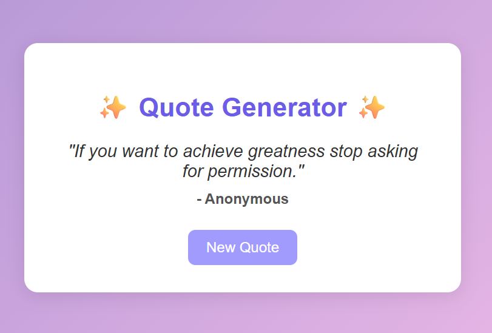

# ✨ Quote Generator App

A simple and aesthetic **Quote Generator** built with HTML, CSS, and JavaScript.  
Click a button to get random motivational quotes — perfect for daily inspiration.


## 🚀 Features

- 🎲 Displays a random quote on each click  
- ✨ Smooth, modern UI design  
- 🧠 Built using only vanilla HTML, CSS, and JS  
- 💡 Beginner-friendly and easy to customize  


## 🛠️ Tech Stack

- **HTML5** – structure of the page  
- **CSS3** – styling and layout  
- **JavaScript (Vanilla)** – logic for generating random quotes  


## 💻 How to Run

1. Clone or download this repository.
2. Open `index.html` in your browser — or use VS Code’s **Live Server** extension.
3. Click the **"New Quote"** button to generate quotes.

---

## 🧩 Customization

You can easily add your own quotes:
```js
const quotes = [
  { text: "Your custom quote here.", author: "Your Name" },
  ...
];

📸 Preview


